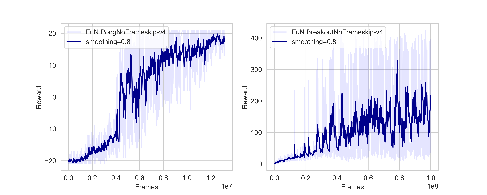

# FeUdal Networks for Hierarchical Reinforcement Learning
This repository implements the FuN architecture from Vezhnevets 2017 et al.
It works out of the box with the current parameters for Breakout, and probably
for most other Atari games too.

Logging is done in two ways: through the cli for basic episodic rewards,
and through Tensorboard for a more detailed analysis.

## Results
Results shown is for a *single* run of Pong for 13 million frames and
BreakoutNoFrameskip-v4 for 100 million frames. It's quite expensive to run
this model for multiple enviroments/seeds, so I am not planning to run
additional experiments.



## Dependencies
- PyTorch v1.4.0
- gym
- python 3.6+

## Usage
Run the following to train for 100 million frames on BreakoutNoFrameskip-v4:
```python main.py```

If instead you would like to test it out on a non-pixel based task such as
CartPole, you need to run


```python main.py --mlp 1 --env-name CartPole-v0```


And you probably want to adjust the number of max_frames.


You can use this repository however you like as long as you cite me somewhere.

## Differences in implementation
I have tried to follow this implementation faithfully to the original paper, but
there is a slight difference: this specific implementation uses A2C like
n-step learning which makes it a bit trickier to time the detaching of LSTMs
with the n-step update plus the end of an episode. In this case, we just
detach the LSTMs after each n-step, with n=K from the original paper,
set to a default value of 400.

Additionally, this implementation does not linearly anneal the learning
rate, but instead keeps it as a constant. This might be why the performance
for breakout is a bit off, but it could also be a wrong value for alpha,
perhaps a higher/lower learning rate, perhaps the value for epsilon
should be much higher or much lower.
